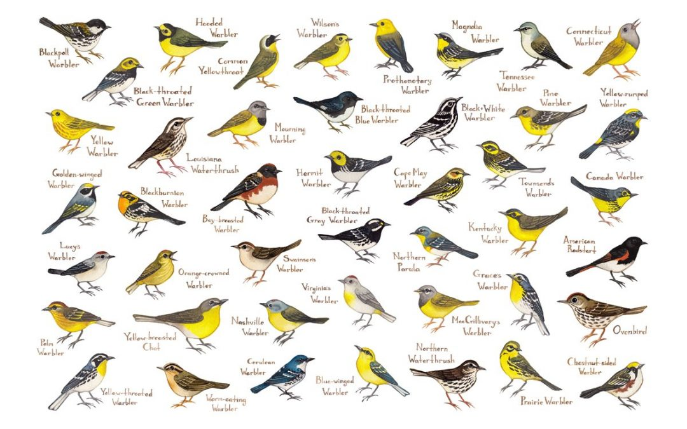

# Bird Species Classification with YOLO

This repository is dedicated to the classification of bird species using the YOLO (You Only Look Once) deep learning model. It aims at leveraging the model's capabilities for real-time and accurate bird species detection from images, contributing to biodiversity monitoring and conservation efforts.

  

## Setup

1. **Clone the Repository**: Get a local copy of the code.
2. **Install Dependencies**: Run `pip install -r requirements.txt`.
3. **Dataset**: Download the bird dataset from [[Dataset Link](https://www.kaggle.com/datasets/gpiosenka/100-bird-species)](#).

## Training the Model

- Preprocess the images using `load_data.py`.
- Initiate training with `train.py` and inference using  `inference.py`:
- Alternatively, you can also perform inference on the streamlit app directly  by running `app.py`. 

## Running Inference

- Use `inference.py` to classify bird species in new images.
- Alternatively, you can also perform inference on the streamlit app directly by running `app.py`. 
.
